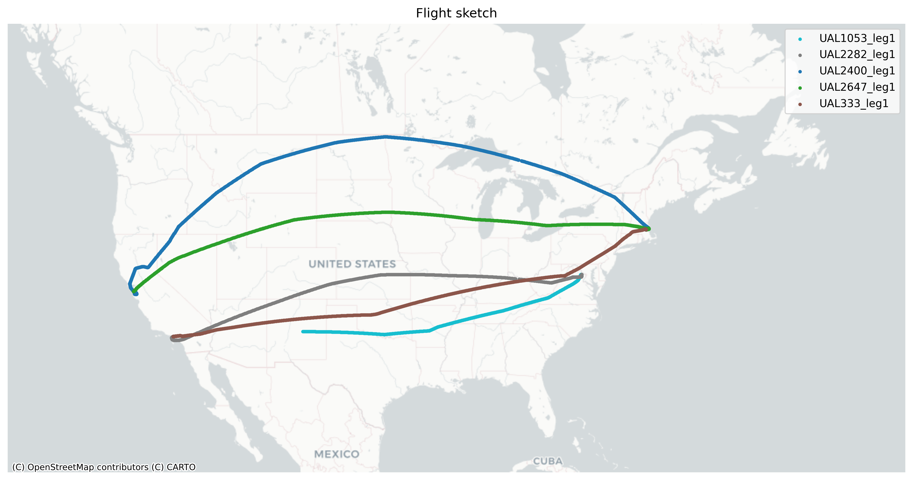

# FlightTracer: tracking ADS-B Exchange flights

[](https://pypi.org/project/flight-tracer/)
[](https://creativecommons.org/publicdomain/zero/1.0/)

**FlightTracer** is a Python package for fetching, processing, storing and plotting flight trace data from [ADS-B Exchange](https://globe.adsbexchange.com/). It provides tools for managing flight data and offers flexible options for users. The project is new and under active development.

---

## **Features**

- Fetches flight trace data from [ADS-B Exchange](https://globe.adsbexchange.com/)
- Identifies flight legs by detecting time gaps and handling Zulu day transitions
- Converts raw flight trace data into GeoDataFrames for easy analysis
- Saves processed flight data in CSV, GeoJSON or shapefile formats
- Visualizes flight paths with customizable basemaps and clear leg differentiation
- Supports AWS S3 uploads for cloud storage
- Offers customization options for file formats and filtering

---

## **Installation**

FlightTracer is available on **PyPI** and can be installed using:

```bash
pip install flight-tracer
```

Alternatively, install the latest development version from GitHub:

```bash
pip install git+https://github.com/stiles/flight_tracer.git
```

### **Dependencies**

FlightTracer requires the following Python packages:
- `requests`
- `pandas`
- `geopandas`
- `boto3`
- `matplotlib`
- `contextily`
- `shapely`

These dependencies will be installed automatically with `pip`.

---

## **Usage**

FlightTracer is designed for flexibility and ease of use. You can track flights using a list of ICAO aircraft IDs or metadata from a URL. The package provides options to customize output formats, filter ground data and configure AWS S3 uploads.

### **Basic example**

Here’s a simple example to fetch and process flight data:

```python
from flight_tracer import FlightTracer
from datetime import date

# Initialize the FlightTracer with an aircraft ID
tracer = FlightTracer(aircraft_ids=["A11F59"])

# Define the date range for fetching trace data
start = date(2025, 2, 7)
end = date(2025, 2, 8)

# Fetch flight data
raw_df = tracer.get_traces(start, end)

# Process the raw data into a GeoDataFrame
if not raw_df.empty:
    gdf = tracer.process_flight_data(raw_df)
    print(gdf.head())
```

---

### **Customizing output**

FlightTracer provides options to save data in different formats and configure the output directory:

#### **Supported file formats**
- CSV
- GeoJSON
- Esri shapefile

#### **Example: Exporting data**
```python
# Save processed data locally
tracer.export_flight_data(gdf, base_path="data/flight_traces", export_format="geojson") # or "shp"
```

---

### **Filtering ground data**

By default, FlightTracer filters out points where the aircraft is on the ground. This can be customized using the `filter_ground` parameter:

#### **Example: Retaining ground data**
```python
gdf = tracer.process_flight_data(raw_df, filter_ground=False)
```

---

### **Handling flight legs**

Flight legs are inferred based on significant time gaps or changes in the aircraft's `call_sign`. The package handles Zulu day transitions to avoid splitting continuous flights.

#### **Example: Inspecting flight legs**
```python
print(gdf["flight_leg"].unique())
```

---

### **Custom basemap visualizations**

FlightTracer allows you to plot flight paths with clear leg differentiation and optional basemap configurations.

#### **Example: Plotting flight paths**
```python
# Plot points with a basemap
tracer.plot_flights(gdf, geometry_type='points', figsize=(12, 8), fig_filename="flight_map.png")
```

---

### **AWS S3 integration**

Easily upload processed data to AWS S3 for cloud storage. Provide your AWS credentials or use an AWS profile:

#### **Example: Uploading to S3**
```python
aws_creds = {
    "aws_access_key_id": "your-access-key",
    "aws_secret_access_key": "your-secret-key"
}

tracer.upload_to_s3(
    gdf,
    bucket_name="your-bucket",
    csv_object_name="flight_data.csv",
    geojson_object_name="flight_data.geojson"
)
```

---

## **Advanced features**

### **Metadata mapping**
Enrich your flight data with custom metadata using mapping options.

#### **Example: Adding metadata**
```python
meta_df = pd.DataFrame({
    "flight": ["AAL124", "UAL1053"],
    "airline": ["American Airlines", "United Airlines"]
})
mapping_info = (meta_df, "flight", "airline", "airline")

# Pass mapping_info to process_flight_data
gdf = tracer.process_flight_data(raw_df, mapping_info=mapping_info)
```

### **Custom time thresholds for legs**
Customize the time gap threshold for detecting new flight legs:

#### **Example: Adjusting time gap threshold**
```python
tracer.set_time_gap_threshold(minutes=45)
```

---

## Outputs

The example above would output two GeoJSON files: One with point features for each moment captured during the aircraft's flight and another with lines representing the overall route(s). Legs of the flights are differentiated in the `flight_leg` item. The script also outputs a CSV and a simple map plot.

```json
"features": [
    {
        "type": "Feature",
        "properties": {
            "point_time": "2025-02-08T02:38:02.920",
            "flight_date_pst": "2025-02-07",
            "altitude": "30000",
            "ground_speed": 408.4,
            "heading": 253.2,
            "lat": 35.968307,
            "lon": -97.348509,
            "icao": "a11f59",
            "call_sign": "UAL333",
            "leg_id": 1,
            "flight_leg": "UAL333_leg1"
        },
        "geometry": {
            "type": "Point",
            "coordinates": [
                -97.348509,
                35.968307
            ]
        }
    }
]
```

**Notes:**

- Values such as altitude and ground speed are raw and uncorrected
- I live in Los Angeles so I convert the `point_time` value from UTC, or Zulu time, to Pacific Time. You can choose your own location.

The plot has different colors for the various legs that day to help you identify them more clearly as you use the data for more advanced visualizations using QGIS or other tools.



---

## **Roadmap**

- **CLI option**: Add a command-line interface for easier usage
- **Improved metadata integration**: Automatically enrich flight data with external sources (e.g., FAA, ICAO)
- **Parallel processing**: Optimize for large datasets
- **Better visualizations**: Add support for tools like Altair or Plotly
- **Analysis tools**: Better understand a flight's speed and altitude changes

---

## **Credits**
Thanks to [ADS-B Exchange](https://globe.adsbexchange.com/) for providing open flight data. Please consider supporting their service by [subscribing](https://store.adsbexchange.com/collections/subscriptions) or [contributing data](https://www.adsbexchange.com/ways-to-join-the-exchange/).

---

## **License**
This project is licensed under the **Creative Commons CC0 1.0 Universal** Public Domain Dedication.

[](https://creativecommons.org/publicdomain/zero/1.0/legalcode)