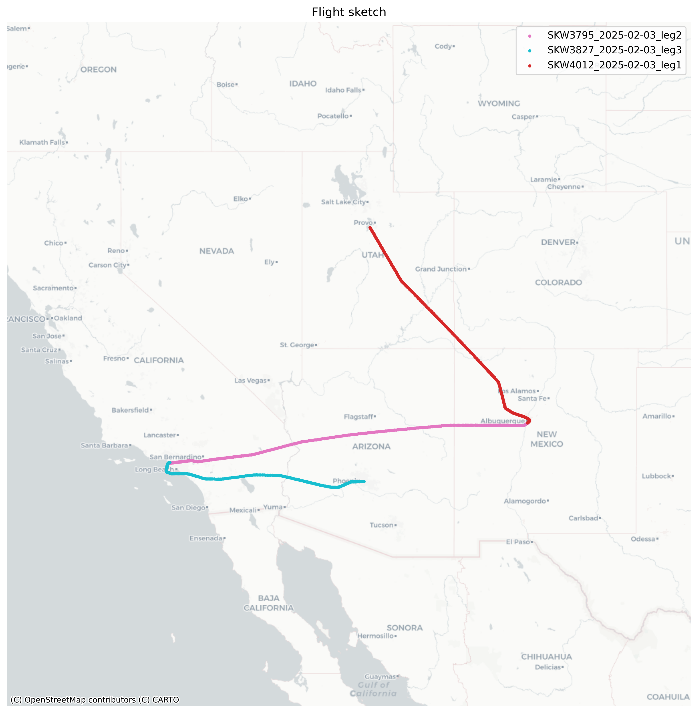

# FlightTracer: Tracking ADS-B Exchange flights

[](https://pypi.org/project/flight-tracer/)
[](https://creativecommons.org/publicdomain/zero/1.0/)

**FlightTracer** is a Python package for fetching, processing, and analyzing flight trace data from **ADS-B Exchange**. It supports a single ICAO code or a list of codes and offers options for exporting processed flight data to **CSV**, **GeoJSON**, and **Amazon S3**.

### Features:
- Fetches real flight trace data from [ADS-B Exchange](https://globe.adsbexchange.com/).
- Seeks to identify flight legs by detecting time gaps in the data.
- Saves processed flight data as CSV and GeoJSON.
- Generates Linestring GeoJSONs for flight paths.
- Provides plotting of flight paths with basemaps.
- Supports AWS S3 uploads for cloud storage.

---

## **Installation**
FlightTracer is available on **PyPI** and can be installed using:

```bash
pip install flight-tracer
```

Alternatively, you can install the latest development version from GitHub:

```bash
pip install git+https://github.com/stiles/flight_tracer.git
```

### **Dependencies**
FlightTracer requires the following packages:
- `requests`
- `pandas`
- `geopandas`
- `boto3`
- `matplotlib`
- `contextily`
- `shapely`

These will be installed automatically with `pip`.

---

## **Usage**
FlightTracer can be used with **a list of aircraft IDs** or **a metadata URL** containing aircraft information.

### **Fetch example**
The following example script fetches all flights made by Skywest `N253SY`, an Embraer ERJ-170, with the ICAO code `a2644a` on Feb 4, 2024. The ICAO code is a url parameter visible with flight traces [are selected](https://globe.adsbexchange.com/?icao=a2644a) on ADS-B Exchange. Add the date and aircraft code to modify the script.

```python
#!/usr/bin/env python
import os
from datetime import date, datetime
from flight_tracer import FlightTracer
import geopandas as gpd

# 1. Use a specific AWS profile from your environment 
# If you have multiple AWS accounts
aws_profile = os.getenv("MY_PERSONAL_PROFILE")

# 2. Use standard AWS credentials from your environment
aws_creds = {
    "aws_access_key_id": os.getenv("MY_AWS_ACCESS_KEY_ID"),
    "aws_secret_access_key": os.getenv("MY_AWS_SECRET_ACCESS_KEY")
}

# You can pass either aws_profile or aws_creds.
# For example, to use the AWS profile:
tracer = FlightTracer(aircraft_ids=["a2644a"], aws_profile=aws_profile)

# Or, if you prefer using credentials alone, comment the above line and use:
# tracer = FlightTracer(aircraft_ids=["a97753"], aws_creds=aws_creds)

# Define the date range for which you want to fetch trace data
start = date(2025, 2, 4)
end = date(2025, 2, 4)

# Fetch raw flight trace data from ADSBExchange
print("Fetching raw flight trace data...")
raw_df = tracer.get_traces(start, end)
if raw_df.empty:
    print("No trace data was fetched.")
else:
    print("Raw data sample:")
    print(raw_df.head())

    # Process the raw data to compute a continuous 'ping_time' (UTC)
    # and to infer flight legs based on time gaps.
    print("\nProcessing flight data into a GeoDataFrame...")
    gdf = tracer.process_flight_data(raw_df)

    # Optionally, retain ground points: 
    # gdf = tracer.process_flight_data(raw_df, filter_ground=False)

    print("Processed GeoDataFrame sample:")
    print(gdf.head())
    
    # Optionally, inspect the unique flight legs detected in the data
    print("\nUnique flight legs detected:")
    print(gdf["leg_id"].unique())

    # Build dynamic filenames that include the ICAO code(s) and today's date
    icao_str = "_".join(tracer.aircraft_ids)
    date_str = datetime.today().strftime("%Y%m%d")
    csv_filename = f"data/flight_traces_{icao_str}_{date_str}.csv"
    geojson_filename = f"data/flight_traces_{icao_str}_{date_str}.geojson"
    linestring_geojson_filename = f"data/flight_traces_lines_{icao_str}_{date_str}.geojson"

    # Save the processed data locally as CSV and GeoJSON
    gdf.to_csv(csv_filename, index=False)
    gdf.to_file(geojson_filename, driver="GeoJSON")
    print(f"\nSaved processed data locally as '{csv_filename}' and '{geojson_filename}'.")

    # Export linestring geometry for each flight leg
    tracer.export_linestring_geojson(gdf, linestring_geojson_filename)

    # Optionally upload the processed files to S3
    bucket_name = "stilesdata.com"  # replace with your bucket name
    csv_object_name = f"flight_tracer/flight_traces_{icao_str}_{date_str}.csv"
    geojson_object_name = f"flight_tracer/flight_traces_{icao_str}_{date_str}.geojson"
    print("\nUploading files to S3 (if AWS credentials are configured)...")
    tracer.upload_to_s3(gdf, bucket_name, csv_object_name, geojson_object_name)
    print("Upload process completed.")

    # Plot the points with a basemap and optionally save the plot as a PNG
    fig_filename = f"visuals/flight_map_{icao_str}_{date_str}.png"
    tracer.plot_flights(gdf, geometry_type='points', figsize=(12,10), fig_filename=fig_filename)
```

### **Using AWS S3 for storage**
If you want to **upload processed flight data** to AWS S3, provide your AWS credentials:

```python
aws_creds = {
    "aws_access_key_id": "your-access-key",
    "aws_secret_access_key": "your-secret-key"
}

tracer = FlightTracer(aircraft_ids=["a97753"], aws_creds=aws_creds)

# Upload to S3
tracer.upload_to_s3(gdf, bucket_name="your-bucket",
                     csv_object_name="flight_data.csv",
                     geojson_object_name="flight_data.geojson")
```

---

## Outputs

The example above would output two GeoJSON files: One with point features for each moment captured during the aircraft's flight and another with lines representing the overall route(s). Legs of the flights are differentiated in the `flight_leg` item. The script also outputs a CSV and a simple map plot.

```json
"features": [
        {
            "type": "Feature",
            "properties": {
                "flight": "SKW4012",
                "point_time": "2025-02-04T00:00:39.650",
                "flight_date_pst": "2025-02-03",
                "point_time_pst_clean": "16:00:39",
                "altitude": "18025",
                "ground_speed": 365.5,
                "heading": 144.4,
                "lat": 40.114529,
                "lon": -111.811419,
                "icao": "a2644a",
                "call_sign": "SKW4012",
                "leg_id": 1,
                "flight_leg": "SKW4012_2025-02-03_leg1"
            },
            "geometry": {
                "type": "Point",
                "coordinates": [
                    -111.811419,
                    40.114529
                ]
            }
        }
    ]
```

**Notes:**

- Values such as altitude and ground speed are raw and uncorrected. 
- Use the `flight_leg` item to identify separate flights in a single calendar day. 
- I live in Los Angeles so I convert the `point_time` value from UTC, or Zulu time, to Pacific Time. You can choose your own location.
- This software is experimental and under active development so use with caution. 

The plot has different colors for the various legs that day to help you identify them more clearly as you use the data for more advanced visualizations using QGIS or other tools. 



---

## **Roadmap**
🔹 **Metadata enrichment**: Integrate external aircraft metadata (FAA, ICAO, etc.)  
🔹 **Performance improvements**: Parallel processing for large datasets  
🔹 **Advanced plotting**: More customizable visualizations  
🔹 **Enhanced CLI tools**: Command-line interface for easy usage  

---

## **Credits**
Thanks to [ADS-B Exchange](https://globe.adsbexchange.com/) for the flight data. If you use the service, consider [subscribing](https://store.adsbexchange.com/collections/subscriptions) or [contributing](https://www.adsbexchange.com/ways-to-join-the-exchange/) data to its network. 

## **License**
This project is licensed under the **Creative Commons CC0 1.0 Universal** Public Domain Dedication.

[](https://creativecommons.org/publicdomain/zero/1.0/legalcode)